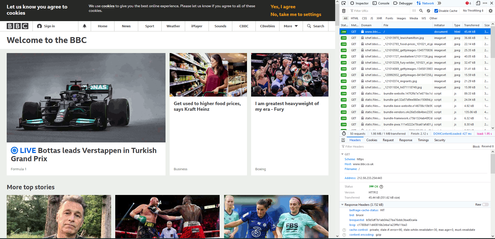

Web Services
============


Objectives
----------

* Understand the fundamentals of HTTP as protocol
* Understand basic tooling to create HTTP requests
* Understand JSON data encoding of structured data
* Understand OpenAPI specifications and how these can be used to describe web services
* Understand the purpose of automated tests and CI (github actions)


Workshop 1: HTTP (1 hour)
----------------

Objectives
* Understand the fundamentals of HTTP as protocol
* Understand basic tooling to create HTTP requests

### Workshop

* 
    * Press `F12`
    * Navigate to `bbc.co.uk`
    * Inspect request/response
        * Headers and content
    * Look at
        * Status: 200 in green
        * Method: GET
        * File: ...
        * Type: html, jpeg, js, json
* [telnet](https://en.wikipedia.org/wiki/Telnet) demo (gotta be quick, timeout is a few seconds)
    ```
    telnet
    o barcampcanterbury.com 80
    ```
    ```
    GET / HTTP/1.1
    Host: barcampcanterbury.com
    ```
* [curl](https://en.wikipedia.org/wiki/CURL)
    * bash tool
    * stands for 'Client'URL
    * command-line tool for making web requests
    * supports https (SSL encryption + certificate checking)
    * `curl https://barcampcanterbury.com/`
        * By default cURL performs a GET request and displays BODY content only
        * `-I` headers only
        * `-vvv` debug
    * `curl barcampcanterbury.com`
        * Servers will normally all redirect to `https`
        * `-L` follow redirects
    * `>` and `<` are direction `*` is additional information about network layer
    * ```
        > GET / HTTP/2
        > Host: barcampcanterbury.com
        > user-agent: curl/7.68.0
        > accept: */*
        ...
        < HTTP/2 200
        < date: Sun, 10 Oct 2021 13:23:13 GMT
        < server: Apache
        < last-modified: Mon, 11 May 2020 18:17:45 GMT
        < etag: "4463-5a5635d0ee376"
        < accept-ranges: bytes
        < content-length: 17507
        < cache-control: max-age=600
        < expires: Sun, 10 Oct 2021 13:33:13 GMT
        < vary: Accept-Encoding,User-Agent
        < content-type: text/html
        <
        <!DOCTYPE html>
        <html lang="en">
        <head>
        ```
    * from BBC website, try to curl jpeg data
        * Chrome - right click - 
            * Copy - Copy URL
                * `curl PASTE_URL`
                    * Binary data (cant show in terminal)
                    * `--output -` garbage in text
                    * `-O` to output to file
                    * try to open image - then delete it
            * (Advanced) Copy - cURL (POSIX)
                * See the additional command-line headers to simulate the Chrome request

### HTTP Request/Response
* [HTTP Messages](https://developer.mozilla.org/en-US/docs/Web/HTTP/Messages)
    * Headers + Body (sometimes called Content or Payload)
    * [HTTP request methods](https://developer.mozilla.org/en-US/docs/Web/HTTP/Methods)
        * GET, POST, PUT, DELETE, OPTIONS, PATCH [jsonpatch](http://jsonpatch.com/)
    * [HTTP response status codes](https://developer.mozilla.org/en-US/docs/Web/HTTP/Status)
        * 200, 302, 4xx, 5xx
    * [Common MIME types](https://developer.mozilla.org/en-US/docs/Web/HTTP/Basics_of_HTTP/MIME_types/Common_types)
* Key points
    * Requests+Responses have Headers+Body
    * As well as GET, we can send requests to upload/edit/modify data the webserver controls with POST, PUT, DELETE requests
    * Servers can respond with a range of errors/messages (your fault 4xx, server fault 5xx)
    * HTTP can be used to return different types of data


JSON
----

Moved to [TeachProgramming -> Language Features](https://github.com/calaldees/TeachProgramming/blob/master/teachprogramming/static/projects/language_features/json.md)


OpenAPI (30min)
-------

* [redocly - FreeCycle](https://redocly.github.io/redoc/?url=https://raw.githubusercontent.com/calaldees/frameworks_and_languages_module/main/openapi.yaml)
* [OpenAPI Sample Pet Store](https://redocly.github.io/redoc/)
* VSCode extension: OpenAPI preview (auto generated from yaml)
* https://swagger.io/specification/
* https://redocly.com/docs/redoc/deployment/cli/
    * ```bash
        alias redocly='docker run --rm -v "$PWD:/spec" -u $(id -u):$(id -g) redocly/cli'
        redocly build-docs openapi.yaml -o openapi.html
        ```
* https://editor.swagger.io/
* https://editor-next.swagger.io/


### using curl to perform HTTP posts

* `POST` example (with JSON data)
    * ```bash
        curl -d '{"key1":"value1", "key2":"value2"}' -H "Content-Type: application/json" -X POST http://localhost:3000/data
        ```

### cURL commands to add an item and read it back
```bash
# for local - http://localhost:8000/
# for GitPod - https://8000-aaa-bbb-1234abcd.ws-eu00.gitpod.io/
#   notice the http(s) differences and where the port is
curl -X POST http://localhost:8000/item -H "Content-Type: application/json" -d '{"user_id": "user1234", "keywords": ["hammer", "nails", "tools"], "description": "A hammer and nails set. In canterbury", "lat": 51.2798438, "lon": 1.0830275}'
curl http://localhost:8000/items
curl http://localhost:8000/item/1
curl http://localhost:8000/items?user_id=user1234
curl -X DELETE http://localhost:8000/item/1
```

### Task

Run my example_server. Either with raw python or starting container.

* Using cURL
    * reminder - use `-vvv` to see more debug details
* Add 4 items
    * with different lat/lon and user_id
    * use /items/? to query different items
* Open the port - get a friend to add an item to your server
    * Read another servers list of items
* (Advanced) do this in javascript (see notes below)


### Further API Practice
* [JSONPlaceholder/guide](https://jsonplaceholder.typicode.com/guide/)
    * Paste into browser or use with other languages
    * This shows how to do exactly what you've done in `curl` (GET, POST with json) with javascript
